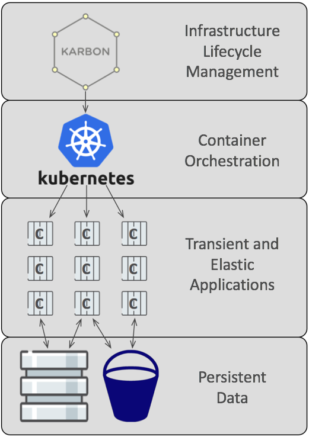

# Nutanix Cloud Native Lab

Traditional Enterprise Applications face a variety of deployment challenges for IT and developers: provisioning a database for a new application may need to pass through a DBA, your storage, network, and virtualization teams; there’s unnecessary complexity as a developer shouldn’t care on which server the application runs, or which LUN the data is stored on; increasing the capacity of an application is a manual and time intensive process; developer workstations likely have different code, packages, and libraries from production servers. These challenges reduce productivity, extend release cycles, and increase software defects.  Let’s dive in to the architecture of Cloud Native Applications, and see how they address these pain points.

At the core of any Cloud Native Platform are containers, as they solve a myriad of problems previously faced by developers: they contain all necessary code, libraries, and settings, they’re portable across a variety of systems, they exclude the weight of a duplicated OS, and they start quickly and are updated easily. However, there are still challenges to deploying and operating container based applications: how do you define an “application” that consists of dozens of containers? Where do you run the containers? How do you track if a container goes down, or an entire host node goes down?

Nutanix Karbon is a turnkey curated enterprise-grade Kubernetes service offering that simplifies the provisioning, operations and lifecycle management of Kubernetes.  It comes with all the benefits you’ve come to expect from the Nutanix Enterprise Cloud Platform, including 1-click deployment, seamless upgrades, built in monitoring with Prometheus, and Nutanix’s industry leading Support.

As you may be aware, containers are ephemeral, so no data should persist within the container. For a cloud native application, some sort of external storage is needed. While file based storage via Nutanix Files or block based storage via Nutanix Volumes are certainly valid choices, cloud native applications are increasingly relying on object based storage, due to its scalability and use of simple HTTP requests. On the Enterprise Cloud Platform, object storage is provided by Nutanix Buckets.  In addition to its scalability and simplicity, Nutanix Buckets self-heals, is extremely secure, and is compatible with S3 APIs.

Beyond simple storage, databases are the pivotal component for many applications, including cloud native applications.  However, databases are complex entities in regards to provisioning and lifecycle management, often due a wide variety of software and hardware technologies.  Nutanix Era is a simple and elegant database management solution that provides database administrators the same ease of use that virtual infrastructure administrators enjoy.  It combines day 1 operations such as 1-click database provisioning, and day 2 operations such as database backup and recovery, and data clone management.

 

Today’s lab will have you deploy a Karbon based Kubernetes cluster, provision an Era DB, create Nutanix Buckets object storage, and deploy a fully functional cloud native application utilizing all of these components.
